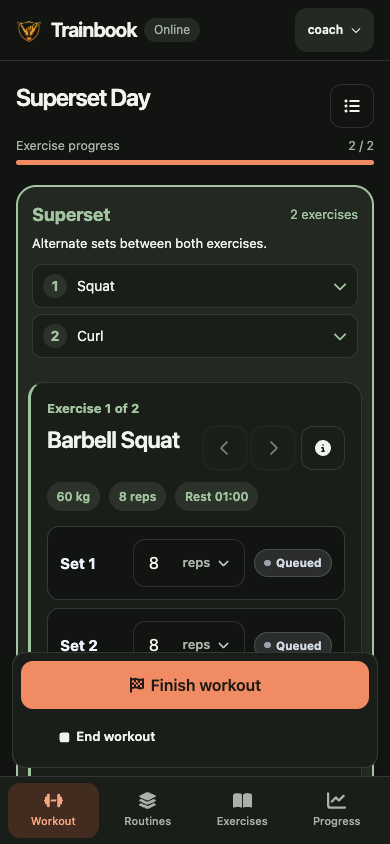
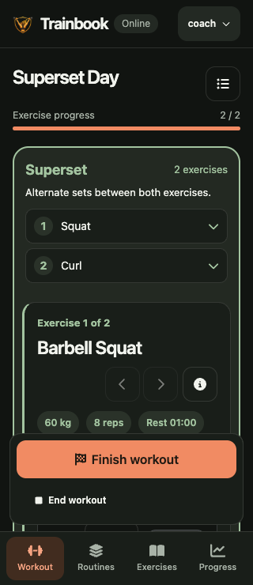

# Superset visibility

Validated on 2026-10-10, based on main at `c194c7b`.

Active supersets now have a highlighted shared border and a summary above the
first checklist that names both exercises. Each card is numbered, and the summary
buttons scroll to and focus either card without advancing or logging exercises.
The summary disappears once only one exercise remains in the pair.

Browser checks used the real local React/Express app with an isolated sample
database at `/private/tmp/trainbook-superset-visibility.sqlite`. At 320×740,
390×844, and 430×932, both names were visible before scrolling and there was no
horizontal document overflow. Both jump buttons were exercised. Screenshots were
visually inspected. These checks used browser viewports, not physical phones.

- `npm run test:coverage`: 29 files, 166 tests passed.
- Coverage: 81.69% statements, 70.65% branches, 86.89% functions, 84.57% lines.
- `npm run build` and `git diff --check`: passed.
- Regression coverage includes both jump controls, focus, unchanged exercise
  start behavior, pair completion, and removal of the group on a single exercise.
- No server, schema, dependency, or workout data changes.

| 390 pixels | 320 pixels |
| --- | --- |
|  |  |
