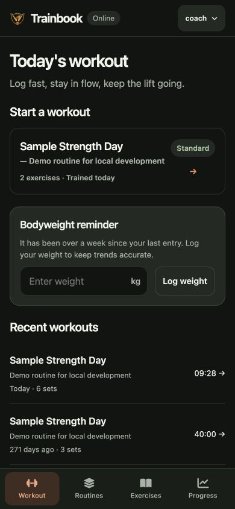
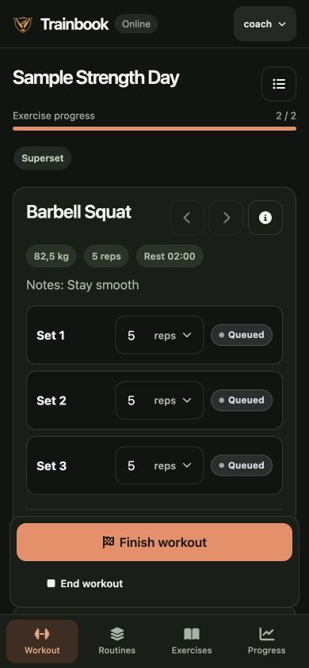
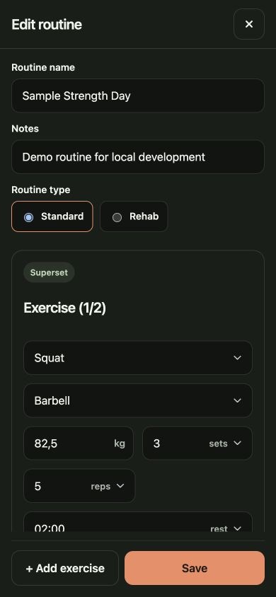
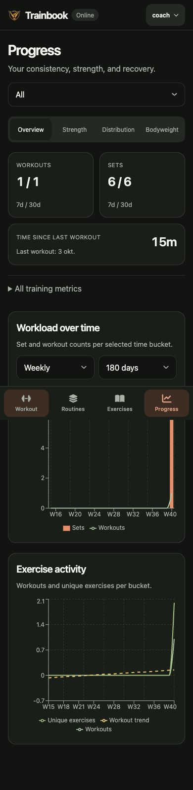

# Mobile redesign validation

Validated on 2026-10-03 on local branch `feature/mobile-redesign`, based on updated
`main` at `7891e29`. This work is local only; no push, merge, or deployment was made.

## Design and retained features

The redesign prioritizes phone use: persistent bottom navigation, quieter charcoal
surfaces, sage/coral accents, native system fonts, larger touch controls, compact
history rows, full-screen editors, and workout actions above the navigation bar.
Current workout sets precede next-workout targets. Progress separates the existing
analytics into four sections while retaining all metrics, charts, and filters.

No server, database schema, data contract, or dependency changes are included.
Workout calculations, sequencing, persistence, and offline replay retain their
existing implementations. Existing routes, including `/stats`, remain supported.

## Feature checks

| Area | Verification |
| --- | --- |
| Navigation and sync | All four routes, active state, scroll reset, account menu keyboard dismissal, offline/queued/syncing/error labels covered by regression tests. |
| Workout logging | Automated workout suites cover warmup, set changes, completion, skip, session persistence, history editing, and undo. Browser checks exercised set reps/checks, navigation away and back, next-target changes, normal completion, early finish, and exercise details. |
| Supersets | Existing automated superset suite passes; paired two exercises in the browser, saved the routine, and started the resulting superset workout. |
| Offline replay | Browser went offline during a workout mutation, then reconnected. SQLite inspection confirmed the edited sets and target persisted, with applied sync operations and no duplicated sets. |
| Routines | Automated create/edit/delete/duplicate/reorder/pair flows retained. Browser editor checks at 320 and 390 pixels verified field fit and reachable sticky save actions. |
| Exercises | Automated catalog/library/archive/merge flows retained. Browser search and edit-dialog checks verified metadata and actions remained available. |
| Progress | Regression tests cover all four sections, retained filters, and muscle drilldown/back. Browser checked overview, strength, distribution drilldown, and bodyweight filters. All additional KPIs remain in the expandable metrics section. |
| Settings and account | Existing automated authentication, account, import/export, and settings tests retained. Browser verified settings controls remained present; no real credentials were changed. |
| Dialogs | New tests cover focus trap, Escape, backdrop/button dismissal, focus restoration, pre-existing background locks, and overlapping dialog transitions. |

Browser validation used the actual local React/Express app with an isolated sample
SQLite database at `/private/tmp/trainbook-mobile-redesign.sqlite`. The user's normal
database was not used. Phone viewports were 320×740, 390×844, and 430×932; inspected
pages and dialogs had no horizontal document overflow. This is browser viewport
validation, not physical iOS/Android device or software-keyboard testing.

## Automated results

- `npm run test:coverage`: **27 files, 161 tests passed** (41.73 seconds).
- `npm run build`: passed.
- `git diff --check`: passed.
- Baseline before changes: 25 files, 153 tests passed.

| Coverage | Before | After | Required |
| --- | ---: | ---: | ---: |
| Statements | 81.41% | 82.11% | 80% |
| Branches | 70.41% | 71.40% | 70% |
| Functions | 85.57% | 86.85% | 80% |
| Lines | 84.29% | 85.01% | 80% |

An earlier full run timed out in the unchanged API import/export test. That test
passed immediately in isolation, and the subsequent complete coverage run passed
without changing its timeout or assertions.

## Screenshots

These screenshots use sample data from the local app.

| Workout home | Active workout |
| --- | --- |
|  |  |

| Routine editor | Progress overview |
| --- | --- |
|  |  |
